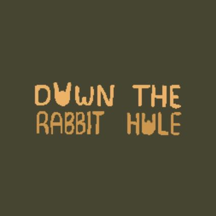

# Down-The-Rabbit-Hole

## ✍️ Introduction
Our project, Down the Rabbit Hole, seeks to take advantage of the addictiveness of scrolling on the internet to encourage youth to learn more. Down the Rabbit Hole addresses a more recent real-world issue: __Internet Addiction__. Internet Addiction affects users worldwide and can become problematic. For example, with the ease of access to information, one may be at risk of finding and circulating biased information. Similarly, youth are often at risk of interacting with non-educational, hyper-stimulating content for long periods. 
### How it Works
With Down the Rabbit Hole, users may become informed about general topics like History, Literature, Technology and more through web scraping. Our project scrapes the web for articles and web pages related to subtopics of these general topics. A segment of the article, which may have an interesting fact or background information about the subtopic, is displayed for the user. A highlighted word or phrase in this segment will link to a separate article. The user may continue ‘down the rabbit hole’ of information and proceed to the article or end the rabbit hole. Providing the user with this choice allows them to be mindful of the time spent in this rabbit hole and ensures that they may access only content which may interest them
## 👩‍🏫 Project Philosphy
## 👩‍💻 Features, Skills and Techniques
### Animation and Graphic Design
 - All designs were created using [Procreate software](https://procreate.art/).
 Procreate is an IOS and iPadOS application for digital illustration and graphic editing. 
### Python
 - This project uses the [Flask web development framework](https://flask.palletsprojects.com/en/2.1.x/) .
 Flask is a web framework written in Python used to create web applications.
 - We created the user authentication system used in our project, as well as the under-lying databases used for this system. 
 - Python was also used for web scraping.
### Html
- Image mapping for multiple pages on the websites
- Formatting images and videos
- Hyperlinks
- Forms
### CSS
- Animations
- Cursor Settings
- Text Styling and Formatting
### Javascript 
## 👏 Contributors
**All original art work created by Annabelle Chung**
### Website by:
- Amanda Rodriques @Mandy-cyber
- Annabelle Chung @annabellechung
- Sarah Cole @juzsarah
## 🙏 Acknowledgements
